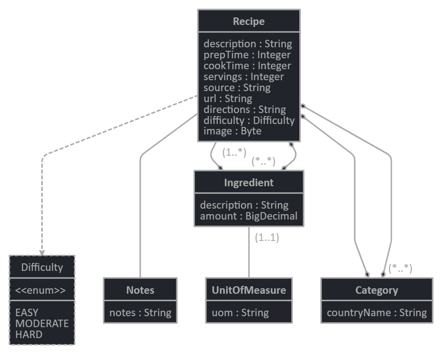
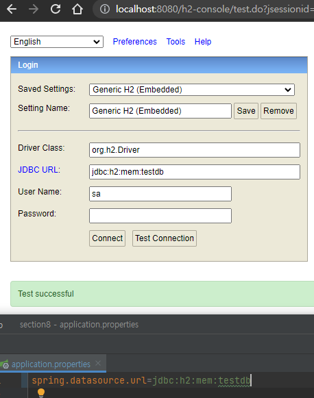

# 스프링5 스터디용 프로젝트

 
This source code is based from 
Spring Framework 5: Beginner to Guru in Udemy by John Thompson. 
I am only showing it in my Github for 
portfolio and personal study purposes as mentioned in section1.  

for details please visit 

https://www.udemy.com/course/spring-framework-5-beginner-to-guru/

 
 

# 📓 출처

[ Spring Framework 5: Beginner to Guru ](https://github.com/springframeworkguru/spring5-recipe-app/tree/add-index-page "udemy")

 

[강의 코드](https://github.com/springframeworkguru/sfg-di/tree/scope-demo "스프링 구루")

[메인](../README.MD "스프링 구루")

 

JPA 스터디

<!-- JPA Model -->

